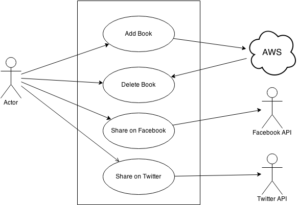

#My Book Library

## 1. Introduction

This simple app is use to collect all users' favourite books. 

In this app, users can type in title, author and release date of the book. Also, users can type in keywords about this book. Keywords here can be one word or several words. In the end, users can put a link of this book here if it has.

What's more, there are two share buttons of Facebook and Twitter. Users can share this app's link via these two buttons if they like this app.

## 2. Web Service

Here is URL for this app running on Amazon Web Service:

http://ec2-54-72-165-147.eu-west-1.compute.amazonaws.com/

## 3. Router

Running this app is based on server.js in lib folder. Here is API routers:

Routes 			|	Functions							|  Methods
----------------------- |  ----------------------------	| --------------
GET /api 		|	test API Running 					|	app.get()
GET	/api/books	|	get all books stored in mongoDB		|	app.get('/api/books')
GET	/api/books/:id	|	get one book from mongoDB		|	app.get('/api/books/:id')
POST	/api/books	|	add a new book to mongoDB		|	app.post('/api/books')
PUT	/api/books/:id	|	update a book in mongoDB		|	app.put('/api/books/:id')
DELETE	/api/books/:id	|	remove a book from mongoDB	|	app.delete('/api/books/:id')

## 4. PhoneGap

What's more, this app is capsulated to mobile app via PhoneGap. Here is a link to download the mobile app:

https://build.phonegap.com/apps/898422/share

Just scanning the two-dimension code is fine. It will be downloaded automatically.

## 5. Use Case

Use cases can be viewed here as well.
